# IllustCart

**IllustCart** is an Android e-commerce marketplace for digital artwork, connecting artists with buyers through a seamless buying and selling experience. Built with Kotlin and Firebase, the app features a dual-interface platform — a customer-facing storefront and a full-featured artist admin panel.

---

## 📱 Screenshots

> Place your screenshots in the `screenshots/` folder at the root of your repository (see [Adding Screenshots](#-adding-screenshots) below).

### Customer Side

| Cover / Splash | Login | Home |
|:-:|:-:|:-:|
| 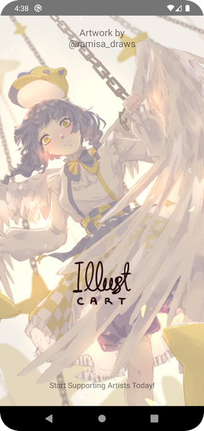 | 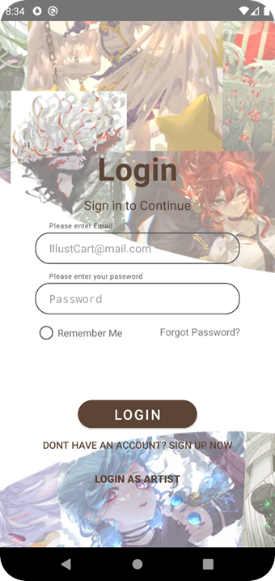 | 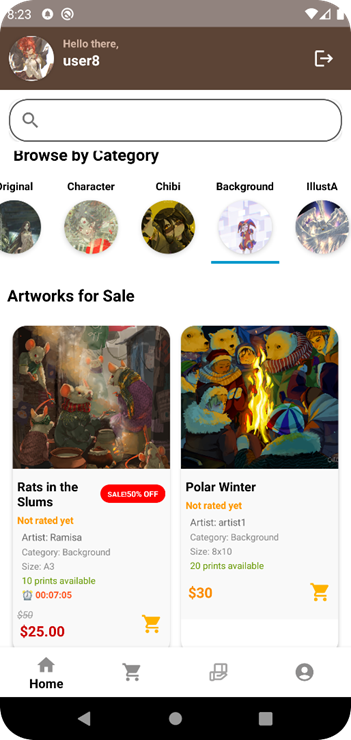 |

| Product Detail | Cart | Orders |
|:-:|:-:|:-:|
| 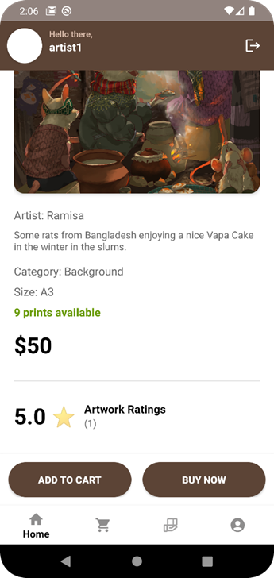 | 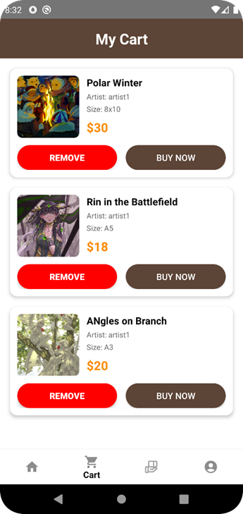 |  |

| Profile | Flash Sale | Ratings & Reviews |
|:-:|:-:|:-:|
| 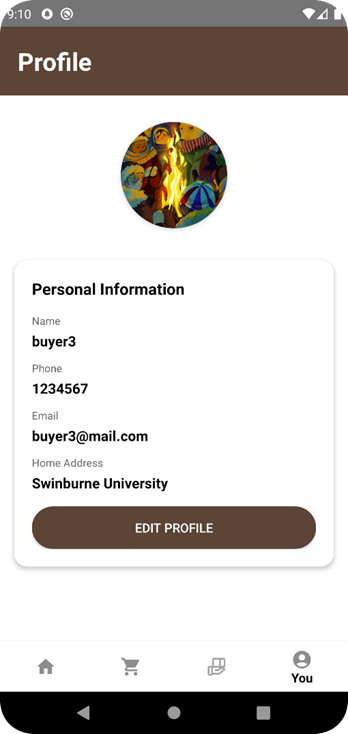 | 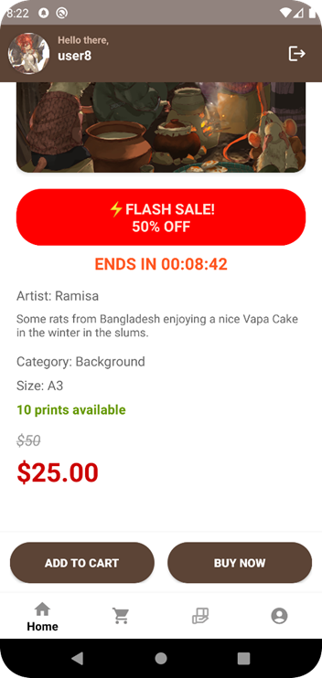 | 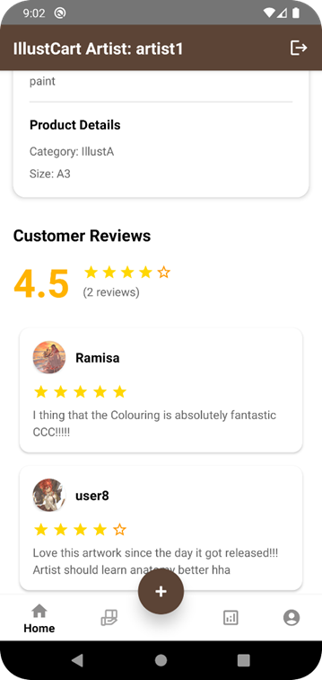 |

### Artist Admin Panel

| Admin Home | Add Product | Edit Product |
|:-:|:-:|:-:|
| 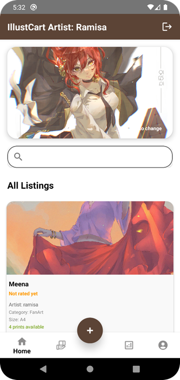 | 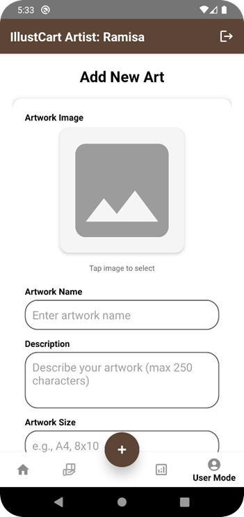 | 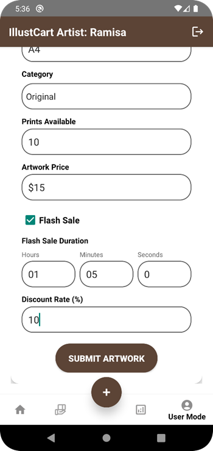 |

| Orders Management | Analytics | Top Artworks |
|:-:|:-:|:-:|
| 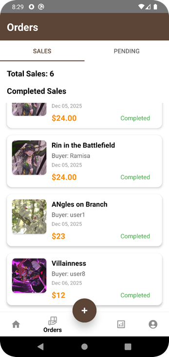 | 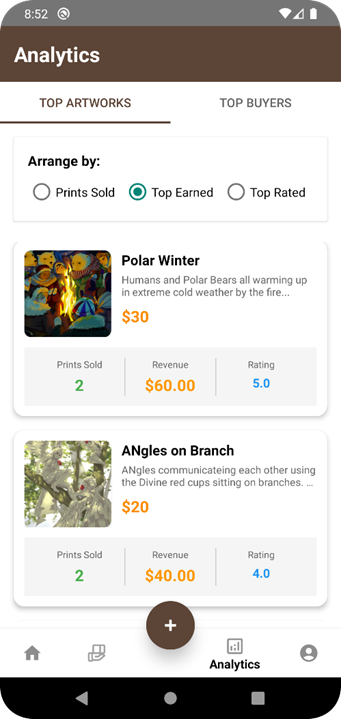 | 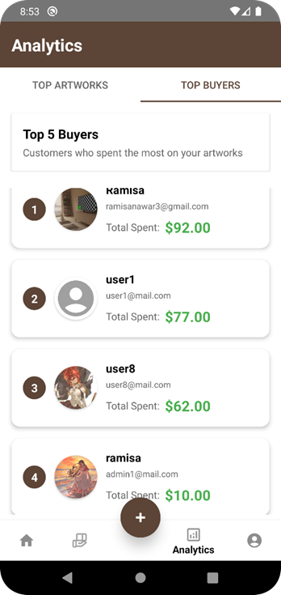 |

---

## Features

### Customer Features
- **Browse & Search** — Explore artwork by category or keyword search
- **Product Details** — View artwork info, size, print availability, and seller details
- **Shopping Cart** — Add multiple items and checkout seamlessly
- **Order Tracking** — Track pending and delivered orders
- **Ratings & Reviews** — Rate and review purchased artworks
- **User Profile** — Manage personal info and delivery address
- **Flash Sale Alerts** — Receive push notifications for live flash sales with countdown timers

### Artist / Admin Features
- **Product Management** — Add, edit, and delete artwork listings with image uploads
- **Flash Sales** — Schedule time-limited discounts with automatic price calculation
- **Order Management** — View and manage pending and completed orders
- **Sales Analytics** — Track revenue, top-selling artworks, and top buyers
- **Push Notifications** — Notify all customers when a flash sale goes live

---

## Tech Stack

| Category | Technology |
|---|---|
| Language | Kotlin |
| Platform | Android (min SDK 27, target SDK 36) |
| Architecture | Activity + Fragment based |
| Database | Firebase Realtime Database |
| Authentication | Firebase Authentication |
| Storage | Firebase Storage |
| Push Notifications | Firebase Cloud Messaging (FCM V1 API) |
| Image Loading | Glide, Picasso |
| HTTP Client | OkHttp3 |
| Auth (FCM OAuth2) | Google Auth Library |
| Async | Kotlin Coroutines |
| UI | Material Design Components |

---

## Getting Started

### Prerequisites
- Android Studio (latest stable)
- Android device or emulator running API 27+
- A Firebase project (see Firebase Setup below)

### Installation

1. **Clone the repository**
   ```bash
   git clone https://github.com/YOUR_USERNAME/IllustCart.git
   cd IllustCart
   ```

2. **Open in Android Studio**
    - Open Android Studio → `File → Open` → select the `IllustCart` folder

3. **Add Firebase configuration files** *(not included in repo for security)*
    - Place `google-services.json` in the `app/` directory
    - Place `service-account.json` in `app/src/main/assets/`
    - See [Firebase Setup](#-firebase-setup) below

4. **Build and run**
    - Connect a device or start an emulator
    - Click **Run ▶** in Android Studio

---

## Firebase Setup

1. Go to [Firebase Console](https://console.firebase.google.com/) and create a project
2. Add an Android app with package name `com.example.illustcart`
3. Download `google-services.json` and place it in `app/`
4. Enable the following Firebase services:
    - **Authentication** — Email/Password sign-in
    - **Realtime Database** — Set up with appropriate security rules
    - **Storage** — For product image uploads
    - **Cloud Messaging** — For flash sale push notifications

### FCM V1 API Setup
1. In Firebase Console → Project Settings → Service Accounts
2. Click **Generate new private key**
3. Save the downloaded file as `service-account.json`
4. Place it in `app/src/main/assets/`

> **Never commit `google-services.json` or `service-account.json` to a public repository.** These files are listed in `.gitignore`.

---

## Project Structure

```
IllustCart/
├── app/
│   ├── src/main/
│   │   ├── assets/
│   │   │   └── service-account.json    ← FCM key (not in repo)
│   │   ├── java/com/example/illustcart/
│   │   │   ├── MainActivity.kt          ← Customer home & product browsing
│   │   │   ├── CartActivity.kt          ← Shopping cart
│   │   │   ├── OrdersActivity.kt        ← Customer order history
│   │   │   ├── ProfileActivity.kt       ← User profile management
│   │   │   ├── Admin_Panel.kt           ← Artist admin dashboard
│   │   │   ├── AdminHomeFragment.kt     ← Product management
│   │   │   ├── AdminOrdersActivity.kt   ← Order management
│   │   │   ├── AdminAnalyticsActivity.kt← Sales analytics
│   │   │   ├── FCMHelperV1.kt           ← Push notification sender
│   │   │   ├── PriceHelper.kt           ← Flash sale price calculation
│   │   │   └── ...
│   │   ├── res/
│   │   │   ├── layout/                  ← XML layout files
│   │   │   ├── menu/                    ← Bottom navigation menus
│   │   │   └── values/                  ← Colors, strings, themes
│   │   └── AndroidManifest.xml
│   ├── google-services.json             ← Firebase config (not in repo)
│   └── build.gradle.kts
├── screenshots/                         ← App screenshots for README
├── .gitignore
└── README.md
```

---

## 📸 Adding Screenshots

To add your screenshots so they display correctly in this README:

1. **Create a `screenshots/` folder** at the root of your project (same level as the `app/` folder)
2. **Add your screenshot images** using these exact filenames:

   | Filename | Screen |
      |---|---|
   | `cover.png` | Splash / cover screen |
   | `login.png` | Login screen |
   | `home.png` | Main home / product browsing |
   | `product_detail.png` | Product detail view |
   | `cart.png` | Shopping cart |
   | `orders.png` | Customer orders |
   | `profile.png` | User profile |
   | `flash_sale.png` | Flash sale badge / countdown |
   | `reviews.png` | Ratings and reviews |
   | `admin_home.png` | Admin product listing |
   | `admin_add_product.png` | Add product form |
   | `admin_edit_product.png` | Edit product form |
   | `admin_orders.png` | Admin orders management |
   | `admin_analytics.png` | Analytics dashboard |
   | `admin_top_artworks.png` | Top artworks chart |

3. **Commit and push** the screenshots folder:
   ```bash
   git add screenshots/
   git commit -m "Add app screenshots"
   git push
   ```

> **Tip:** Use Android Studio's emulator to take screenshots with `Ctrl+S` (Windows) or the camera icon in the emulator toolbar. Resize them to around **360×800px** for a clean README display.

---

## Developer

**Ramisa** — COS30017 Software Development for Mobile Devices

---

## License

This project is developed for academic purposes.